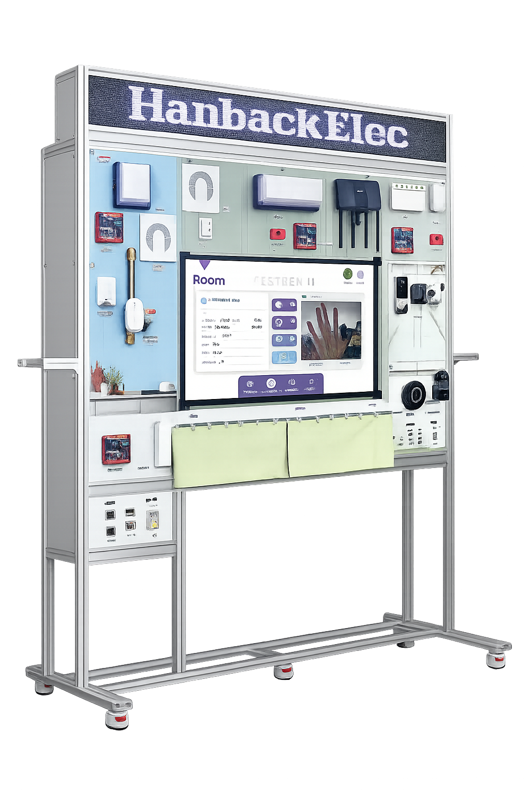
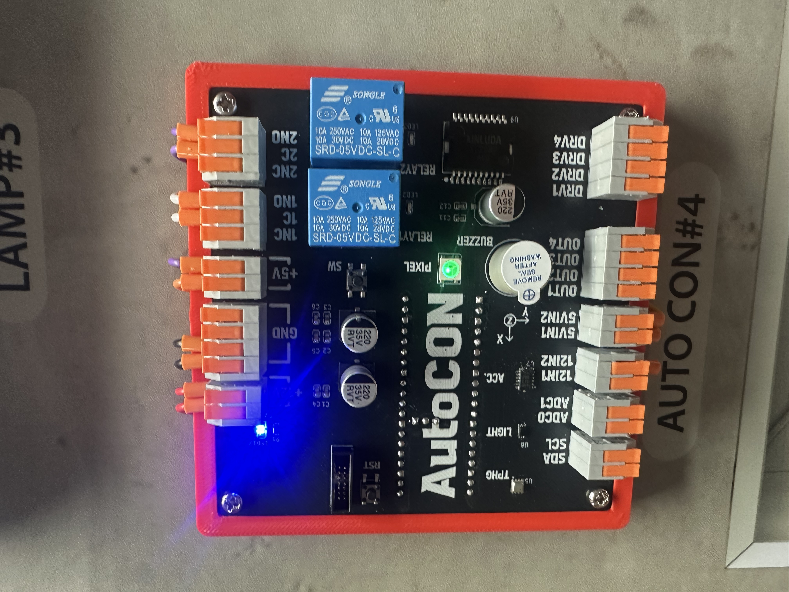
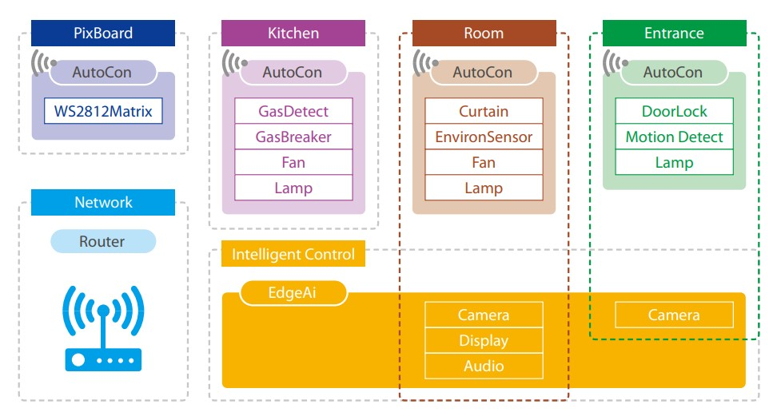
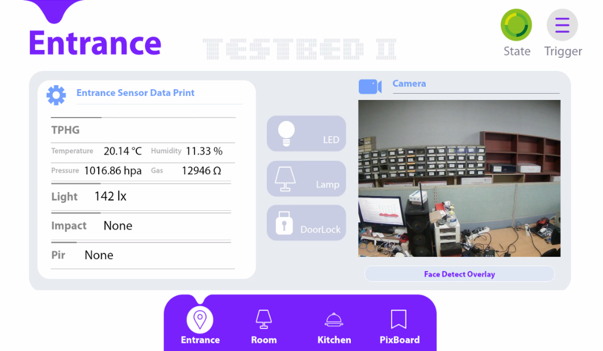
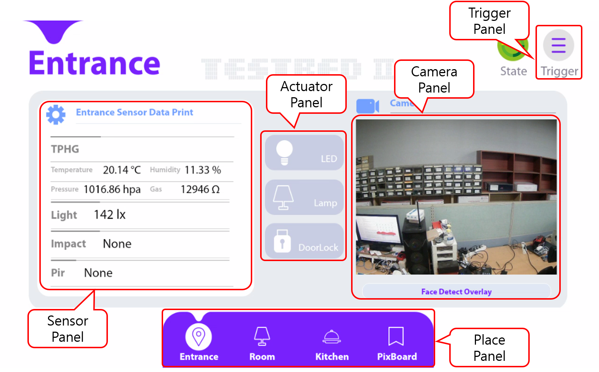
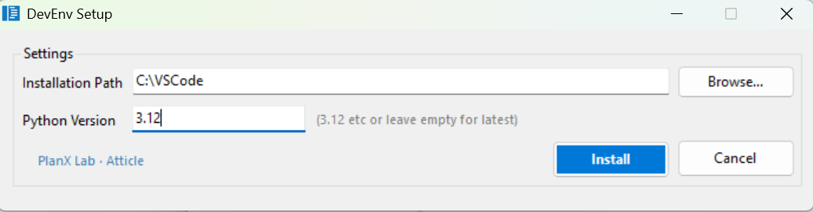
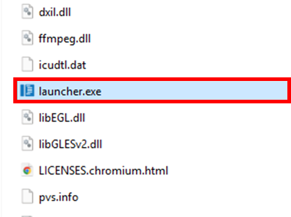

# TestBed II
IoT 센서가 부착된 장비는 온도, 습도, 압력, 진동 등 다양한 데이터를 실시간으로 수집하여 전송하며, 이렇게 수집된 데이터를 분석함으로써 생산 공정의 효율성을 극대화하고 불량률을 감소시키며 생산량을 최적화할 수 있습니다.  

또한, IoT 데이터 기반의 공정 자동화를 통해 특정 조건 충족 시 기계의 자동 작동 또는 정지 설정이 가능해져 인적 오류를 줄이고 생산 속도를 향상시킬 수 있으며, 장비 상태를 실시간으로 모니터링하여 고장을 사전에 예측하고 예방함으로써 장비 수명 연장 및 갑작스러운 고장으로 인한 생산 차질을 최소화합니다.

산업별 IoT 기술 적용 사례는 다음과 같습니다.

- 제조업: 스마트 팩토리 구축을 통해 생산 공정의 효율성을 극대화하고, 불량률을 최소화하며, 생산성 향상
- 에너지 산업: 스마트 그리드를 구축하여 에너지 효율을 높이고, 전력 공급의 안정성 향상 
- 물류 산업: 물류 추적 및 관리를 자동화하여 물류 효율성을 높이고, 배송 시간 단축
- 농업: 스마트 팜을 구축하여 작물의 생육 환경을 최적화하고, 생산량 증대

## 플랫폼 구성
TestBed II는(이하 TestBed) 가정, 사무실, 공장 등에 설치된 인터넷 기반 자동 설비 제어에 필요한 소프트웨어 기술 학습을 위한 플랫폼입니다. HMI와 Auto 제어기, Auto 제어기용 주변장치 등으로 구성됩니다.  



### HMI (Human Machine Interface)
HMI는 사용자와 기계간의 상호작용을 가능하게 해주는 인터페이스입니다. 자동화 산업에서 기계와 작업자 간의 통신을 원활하게 하여 작업 효율을 높이는 데 사용됩니다. 사물 인터넷(IoT) 환경에서 데이터를 수집하고 전송하며, 데이터를 시각화 하는 용도로도 활용됩니다. 
TestBed II의 HMI는 Linux 계열의 OS를 기반으로 다양한 프로그래밍 언어를 처리할 수 있으며, Wi-Fi나 Bluetooth를 통해 무선 통신기능을 포함하고 있습니다. 

TestBed은 HMI는 다음과 같은 특징을 갖습니다.

- ARM Cortex-A78 기반의 고성능 CPU 탑재
- Wi-Fi 및 Bluetooth, BLE 기반의 무선 통신 기능 제공 
- 43-inch LCD 및 TouchScreen 탑재
- 머신러닝 기반 스마트홈 자동화 확장을 위해 AI 가속기 지원 

### Auto 제어기 
Auto 제어기는 PWM 컨트롤러, I/O 포트등을 통해 산업 현장의 다양한 장치를 제어할 수 있습니다. PWM 컨트롤러로 조명의 밝기나 DC 모터의 속도를 정밀하게 조절할 수 있습니다. 또한, IO 포트를 통해 스위치, 가스 누설 감지 센서 등을 연결하여 다양한 상황을 감지하고 대응할 수 있습니다. 



TestBed의 Auto 제어기는 앞서 설명과 같이 구역별로 장착되어 있습니다. 현관에 1개, 침실에 2개, 주방에 1개, 전광판에 1개가 장착되어 있으며 전원 공급과 함께 연결되어있는 주변장치를 초기화 하고 외부 명령을 통해 제어가 가능한 상태로 대기합니다. 액츄에이터는 동작을 눈으로 확인하는것에 거치지않고, 피드백 신호를 통해 제어 신호가 정상적으로 동작했는지 확인도 가능합니다.  

각 액츄에이터와 센서 목록은 다음과 같습니다. 

#### Actuator List 
**Lamp**  
TestBed의 Lamp는 총 3개가 장착되어 있으며 단색 LED로 구성되며, 각각 현관, 주방, 방에 장착되어 있습니다. 

**Fan**  
TestBed의 Fan은 총 2개가 장착되어 있으며 각각 침설, 주방에 장착되어 있습니다. 실제 Fan의 동작을 통해 움직임 확인도 가능하며, 함께 장착된 LED를 통해 동작여부를 쉽게 확인할 수 있습니다. 

**Doorlock**  
DoorLock은 현관 문을 열거나, 닫는 용도입니다.  

**GasBreaker**  
GasBreaker는 주방에 위치하고 있으며 주방의 가스벨브를 제어하는 역할을 담당합니다.  

**Curtain**  
Curtain은 침실에 위치하고 있으며 좌우로 움직이며, 실제 집의 거실이나 침실에 주로 장착되는 장치로 원격으로 제어할 수 있습니다.

**Led**
RGB Led로 구역의 통신 상태등을 표기하는 용도로 활용할 수 있습니다. 

#### Sensor List

**PIR Sensor**  
PIR 센서(Passive Infrared Sensor)는 사람이나 동물의 움직임을 감지하는 데 사용되는 전자 센서입니다. 

**Light Sensor**  
Light 센서는 주변의 밝기를 측정하는 센서입니다. 측정 단위는 룩스(lx) 입니다. 

**TPHG Sensor**  
TPHG 센서는 4가지 기능을 포함하고 있습니다. 각각의 기능은 다음과 같습니다.   
- T : 온도(Temperature)  
- P : 기압(Pressure)  
- H : 습도(Humidity)  
- G : 가스(Gas)

**Dust Sensor**  
Dust 센서는 먼지감지 센서로 1.0μm, 2.5μm, 10μm 의 미세먼지를 측정합니다.  

**Gas Detector**  
Gas 탐지기는 LPG, NG등을 측정가능한 센서로 센서 내부의 저항 변화를 측정하여 공기중 가연성 가스 존재를 측정합니다. 

**Impact Sensor**  
3축 가속도 측정이 가능한 센서로 TestBed에서는 충격을 감지하는 용도로 활용됩니다. 

## TestBed 구성도  
TestBed의 장치 구성은 다음과 같습니다. 


### Hardware Block 


TestBed 는 3개의 구역과 1개의 전광판으로 이루어집니다. 3개의 구역은 현관(Entrance), 침실(Room), 주방(Kitchen) 이며 전광판은 PixBoard라 합니다. 3개의 구역과 전광판은 모두 Auto 제어기가 장착되어 있으며, Auto 제어기를 통해 주변장치를 제어하고 센서 데이터를 수집합니다. Auto 제어기는 Wi-Fi를 통해 Router에 연결되며, HMI(EdgeAI)에 설치된 MQTT 브로커를 통해 상호 제이터를 주고 받습니다. 

#### 현관(Entrance)
현관에는 DoorLock, Lamp 액츄에이터와 Motion Detect, TPHG, Light, Impact 센서가, 그리고 현관 앞의 상황을 감지할 수 있는 카메라가 존재합니다. 

#### 침실(Room)
침실에는 Curtain, Lamp, Fan 액츄에이터와 Dust, TPHG, Light, Impact 센서가, 그리고 침실의 상황을 감지할 수 있는 카메라가 존재합니다.

#### 주방(Kitchen)
주방에는 GasBreaker, Lamp, Fan 액츄에이터와 GasDetector, TPHG, Light, Impact 센서가 존재합니다.

#### 전광판(Pixboard)
전광판에는 다양한 글자를 표기할 수 있으며, 글자의 색상, 배경 색상을 조절하고 좌측 또는 우측으로 자동 스크롤하는 기능등을 활용할 수 있습니다. 

## TestBed 첫 활용  
TestBed의 전원은 정면기준 우측 하단에 위치합니다. 우측하단 `POWER` 하단부에 전원케이블을 220V에 연결하여 사용합니다. 


전원을 켜면 TestBed의 각종 장치가 초기화됩니다. HMI는 부팅이 진행되며 부팅이 완료되면 화면에 TestBed를 제어할 수 있는 화면이 출력됩니다. 화면에 출력된 프로그램을 통해 TestBed 제어도 가능하고, 자신의 PC 혹은 노트북등에서 원격으로도 제어가 가능합니다. 



### TestBed GUI 
TestBed GUI 기본 화면 구성은 다음과 같습니다. 



크게 5개의 부분으로 구성됩니다. 
- Sensor Panel : 구역별 센서 데이터를 출력합니다. 
- Actuator Panel : 구역별 제어가능한 액츄에이터가 출력되며 클릭을 통해 제어가 가능합니다. 
- Camera Panle : 현재 카메라 화면이 출력됩니다. 인공지능 모델이 동작중이며, 현관 카메라는 얼굴인식, 침실 카메라는 손동작 인식 모델이 동작중입니다. 
- Place Panel : 구역을 전환하는 버튼입니다. 
- Trigger Panel : 자동제어 조건을 설정할 수 있는 화면입니다. 

#### 현관 제어 GUI 
현관에 위치한 센서들의 현재 센서 데이터가 표시되고, 가운데 버튼을 통해 액츄에이터를 제어할수 있습니다. 또한 카메라 화면을 실시간으로 확인이 가능한데, 카메라 화면은 얼굴인식 모델이 동작하여 카메라이 인식된 얼굴이 있다면 박스를 표기하여 인식결과를 화면에 출력합니다. 


#### 침실 제어 GUI 
침실에 위치한 센서들의 현재 센서 데이터가 표시되고, 버튼을 통해 액츄에이터를 제어합니다. 커튼 제어 버튼은 좌측부터 순서대로 열기, 정지, 닫기 버튼입니다. 침실의 카메라는 손동작 인식 모델과 함께 동작하고 있으며 손동작으로 장치를 제어하고 싶다면 카메라 화면 아래 `Gesture Control` 버튼을 누르고 카메라 앞에서 특정 동작을 하면 장치가 제어됩니다. 


인식하는 동작의 종류와 동작에 따른 제어 설명은 `Gesture Details` 버튼을 누르면 확인할 수 있습니다. 


#### 주방 제어 GUI 
주방에 위치한 센서들의 현재 센서 데이터가 표시되고, 가운데 버튼을 통해 액츄에이터를 제어할수 있습니다. 


#### 전광판 제어 GUI 
전광판 제어 화면에서는 원하는 글자를 입력하고 움직이는 방향을 설정할 수 있습니다. 속도는 0~9 까지 단계를 설정하여 속도 제어가 가능하며, 움직이는 방향은 `left`, `right`, `off` 총 3가지 설정이 가능합니다. 색상은 글자의 색상과 배경 색상을 따로 지정하여 전광판에 출력할 수 있습니다. 글자 입력은 `Text Input` 부분을 터치하면 가상키보드가 출력되며 가상 키보드를 통해 입력할 수 있습니다. 


#### 자동 제어 설정 GUI 
자동 제어 설정 GUI 를 통해 원하는 조건을 통한 자동 제어를 체험할 수 있습니다. 3개까지 설정가능하며 새로 추가할때 구역, 센서종류, 조건 등의 상세 설정을 진행하여 조건에 따라 어떤 액츄에이터를 자동으로 제어할것인지 설정하여 저장합니다. `Active` 버튼을 누르게되면 조건이 활성화되며 센서 데이터값을 주기적으로 모니터링하며 설정한 조건에 맞다면 자동으로 장치를 제어합니다. 


## 개발환경 구축
### Visual Studio Code
Visual Studio Code(VSCode)는 MS에서 Electron 프레임워크를 기반으로 개발된 무료 프로그램으로 추가로 원하는 확장 기능을 설치해야 IDE로 사용 가능합니다. 윈도우를 비롯해 리눅스 Mac을 모두 지원하며 파이썬을 비롯해 다양한 언어와 부가 기능을 수 많은 확장 기능으로 지원합니다.

### VSCode 설치 및 설정 
VSCode 편집기를 IDE로 사용하기 위해선 다양한 Extension들을 설치해주고 직접 설정해주어야 하는 불편함이 있습니다. 한백전자에서는 이러한 불편함을 해소시키기 위해 Windows에서 VSCode 및 pwsh 등 여러 편리한 개발환경들을 자동으로 설치해주는 스크립트를 제공합니다. 설치하는 방법은 다음과 같습니다.

아래 링크에 접속한 후 설치 파일을 다운로드 받습니다.

- [Install File Link](https://raw.githubusercontent.com/hanback-lab/devenv-setup/refs/heads/main/devenv-setup.exe)

파일을 다운로드 받은 후 탐색기로 다운로드한 위치로 이동한 후 `devenv-setup.exe` 파일을 실행합니다. 이 후 아래의 사진과 같이 프로그램이 실행됩니다. `Installation Path` 입력 칸에는 VSCode가 설치될 경로를, `Python Version` 입력 칸에는 설치할 파이썬 버전을 입력할 수 있습니다. 다만 파이썬 버전은 추후 교재에서 진행할 실습을 원활히 진행하기 위해 Python 버전을 3.12로 고정해 주시길 바랍니다. 



입력 완료 후 `Install` 버튼을 누르면 VSCode 및 필요한 패키지가 설치됩니다. 설치가 완료되면 다음 경로로 이동합니다.  

```sh
C:\VSCode\
```

폴더 내부에 launcher.exe 파일을 실행하여 VSCode를 실행합니다. 이 launcher 프로그램은 실행 시 VSCode 관련 패키지의 버전 확인 및 자동 업데이트 기능을 실행과 동시에 진행합니다.



## TestBed 네트워크 연결 
TestBed는 내부에 무선 공유기가 설치되어 있으며, 이 공유기를 통해 유선 혹은 무선으로 접속이 가능합니다. TestBed에 전원을 인가하고 PC 혹은 노트북의 Wi-Fi 검색하면 "testbed2" 이름으로 Wi-Fi 가 검색되는것을 확인할 수 있습니다. 


TestBed 내부의 무선 공유기의 SSID 와 Password 는 다음과 같습니다. 

- TestBed 2 AP SSID : testbed2
- TestBed 2 AP Password : testbed2!

HMI 는 공유기에 유선으로 연결되어 있고 고정된 IP를 할당받고 있습니다. 

- HMI IP : 192.168.50.2 
- User ID : soda
- User Password : soda 

Wi-Fi 를 연결하고 이후 장치 제어 프로그래밍을 진행할 떄 HMI IP 를 잘 확인하여 활용하시기 바랍니다. 

