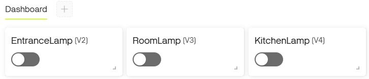
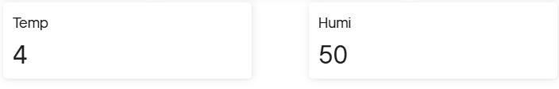
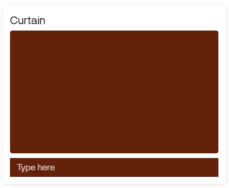

# IoT Dashboard Service 기반 TestBed 제어 
"5.1 IoT Dashboard Service" 에서 제어한 내용을 기반으로 간단한 Dashboard를 구성하고 TestBed를 제어하거나, 센서데이터를 원격으로 모니터링하는 실습입니다. 

## 원격 램프 제어 
TestBed의 Lamp는 3개입니다. 현관, 주방, 방에 각각 1개씩 위치해 있으며, 이를 Web Dashboard를 통해 제어합니다. 

### Datastream 구조 
램프 제어를 위한 Datastream 설정은 다음과 같습니다. 

| Where | Virtual Pin | Data Type | Min | Max | Default |
|:---:|:---:|:---:|:---:|:---:|:---:|
| Entrance | V2 | Integer | 0 | 1 | 0 | 
| Room | V3 | Integer | 0 | 1 | 0 | 
| Kitchen | V4 | Integer | 0 | 1 | 0 | 

램프의 제어 상태는 "On" 또는 "Off" 두가지 상태입니다. 따라서 정수형태의 데이터로 처리하고 1인경우 "On" 0인경우 "Off"로 구성합니다. 

### Web Dashboard 구성 
Dashboard에서는 Switch 위젯을 통해 제어를 합니다. 3개의 스위치 위젯을 배치하고 각 Switch에 맞는 Datastream을 설정합니다. 아래 그림은 배치 예시 입니다. 



### 제어 코드 
Blynk를 통해 TestBed의 Lamp를 제어하는 코드는 다음과 같습니다. 

```python
from paho.mqtt.client import Client
from testbed.actuator import LampGroup
import ssl

broker_addr = "blynk.cloud"
token = "your-token"

lg = LampGroup()

def on_message(client, userdata, msg):
    global lg
    if 'EntranceLamp' in msg.topic:
        if int(float(msg.payload.decode("utf-8"))):
            lg.on('entrance')
        else:
            lg.off('entrance')
    elif 'RoomLamp' in msg.topic:
        if int(float(msg.payload.decode("utf-8"))):
            lg.on('room')
        else:
            lg.off('room')
    elif 'Kitchen' in msg.topic:
        if int(float(msg.payload.decode("utf-8"))):
            lg.on('kitchen')
        else:
            lg.off('kitchen')

def on_connect(client, userdata, flags, rc):
    if rc==0:
        client.subscribe("downlink/ds/EntranceLamp", qos=0)
        client.subscribe("downlink/ds/RoomLamp", qos=0)
        client.subscribe("downlink/ds/KitchenLamp", qos=0)

client = Client()
client.tls_set(tls_version=ssl.PROTOCOL_TLSv1_2)
client.on_connect = on_connect
client.on_message = on_message
client.username_pw_set("device", token)
client.connect(host=broker_addr,port=8883,keepalive=45)
client.loop_forever()
```

## 온도/습도 모니터링 
이번에는 TPHG 센서의 데이터중 온도와 습도 데이터를 Web Dashboard로 모니터링 해보도록 하겠습니다. 

### Datastream 구조 
온도/습도 모니터링을 위한 Datastream 설정은 다음과 같습니다. 

| Sensor | Virtual Pin | Data Type | Min | Max | Default |
|:---:|:---:|:---:|:---:|:---:|:---:|
| TPHG(Temp) | V5 | Integer | 0 | 50 | 0 | 
| TPHG(Humi) | V6 | Integer | 0 | 100 | 0 | 

### Web Dashboard 구성 
Dashboard에서는 Label 위젯을 통해 데이터를 표기합니다. Gauge 혹은 Chart 위젯을 활용해도 관계 없습니다. 원하는 위젯을 배치하고 Datastream을 설정합니다. 아래 그림은 배치 예시 입니다. 



### 제어 코드 
Blynk를 통해 TestBed의 온도/습도 센서를 모니터링하는 코드는 다음과 같습니다. 센서로부터 수신된 데이터를 1초마다 전송합니다. 

```python
from paho.mqtt.client import Client
from testbed.sensor import Tphg 
import time 
import ssl

broker_addr = "blynk.cloud"
token = "your-token"

data = 0 

tphg = Tphg('ROOM')
client = Client()
client.tls_set(tls_version=ssl.PROTOCOL_TLSv1_2)
client.username_pw_set("device", token)
client.connect(host=broker_addr,port=8883,keepalive=45)
client.loop_start()

while True:
    try:
        data = tphg.read()
        client.publish("ds/Temp",data['temp'])
        client.publish("ds/Humi",data['humi'])
    except:
        pass
    time.sleep(1)
```

## 터미널을 활용한 문자열 처리 
Blynk에서 활용가능한 위젯중에는 Terminal이 있습니다. 이 Terminal은 명령프롬프트와 같이 활용이 가능하며, 문자 혹은 숫자를 입력하여 전달할 수 있습니다. 이 방법을 활용하면 단순 숫자를 수신하여 처리하는 형태보다는 조금더 다양한 처리가 가능합니다. 여기서는 문자를 수신받아서 Curtain을 제어하는 실습을 진행합니다. 

### Datastream 구조 
Curtain 제어를 위한 Datastream 설정은 다음과 같습니다. 문자열을 주고 받는 형태이기 때문에 Data Type은 String 입니다. 기본값은 별도로 설정하지 않습니다. 

| Actuator | Virtual Pin | Data Type | 
|:---:|:---:|:---:|
| Curtain | V7 | String | 

### Web Dashboard 구성 
Dashboard에서는 Terminal 위젯을 통해 데이터를 표기합니다. 표기되는 문자를 조금더 많이 표기하고 싶다면 크기는 조정하여 활용합니다. 아래 그림은 배치 예시 입니다. 



### 제어 코드 
Blynk를 통해 TestBed의 Curtain을 제어하는 코드는 다음과 같습니다. 위젯으로 부터 수신된 문자를 분석하여 TestBed의 Curtain을 제어합니다.  

```python
from paho.mqtt.client import Client
from testbed.actuator import Curtain
import ssl

broker_addr = "blynk.cloud"
token = "your-token"

curtain = Curtain()

def on_message(client, userdata, msg):
    global curtain
    if 'Curtain' in msg.topic:
        payload = msg.payload.decode("utf-8").lower()
        if payload == "open":
            curtain.open()
        elif payload == "close":
            curtain.close()
        elif payload == "stop":
            curtain.stop()

def on_connect(client, userdata, flags, rc):
    if rc==0:
        client.subscribe("downlink/ds/Curtain", qos=0)

client = Client()
client.tls_set(tls_version=ssl.PROTOCOL_TLSv1_2)
client.on_connect = on_connect
client.on_message = on_message
client.username_pw_set("device", token)
client.connect(host=broker_addr,port=8883,keepalive=45)
client.loop_forever()
```


<details>
<summary>연습문제</summary>

## 연습문제 
Blynk 를 활용하여 다음의 조건의 조건을 충족하는 시스템은 구성해 보세요. 

- Switch 위젯을 통한 Room Lamp 제어
    - Room의 Light 센서의 데이터가 200 이하인 경우 On 상태 유지 
- Switch 위젯을 통한 Room Fan 제어 
    - Room의 TPHG 센서의 Temperature 데이터가 25 이상인 경우 On 상태 유지 
- Gauge 위젯을 통한 센서데이터 모니터링 
    - Light 
        - Data Type : Integer 
        - Min : 0 
        - Max : 65535
    - TPHG(Temperature)
        - Data Type : Integer 
        - Min : 0 
        - Max : 50
</details>