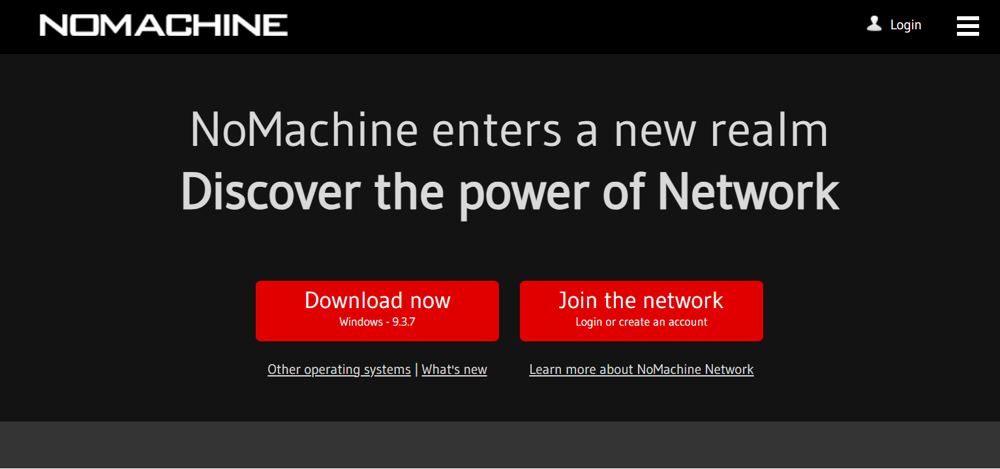
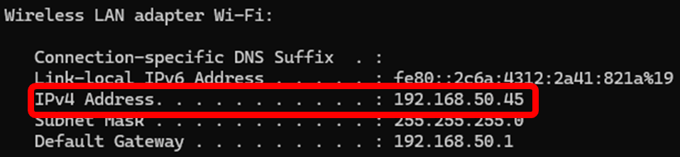
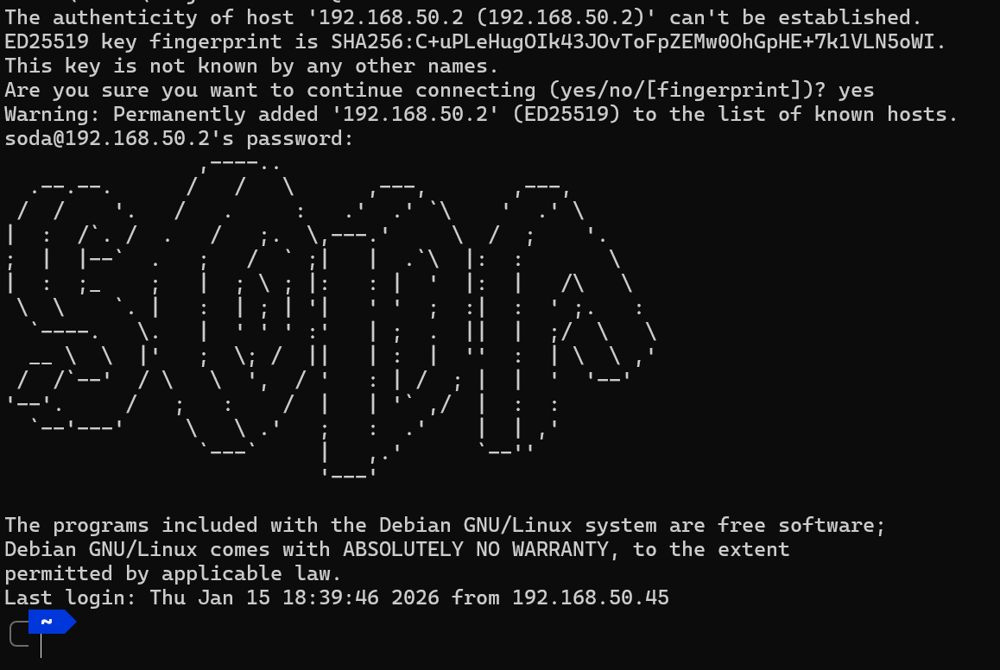
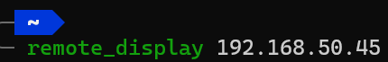
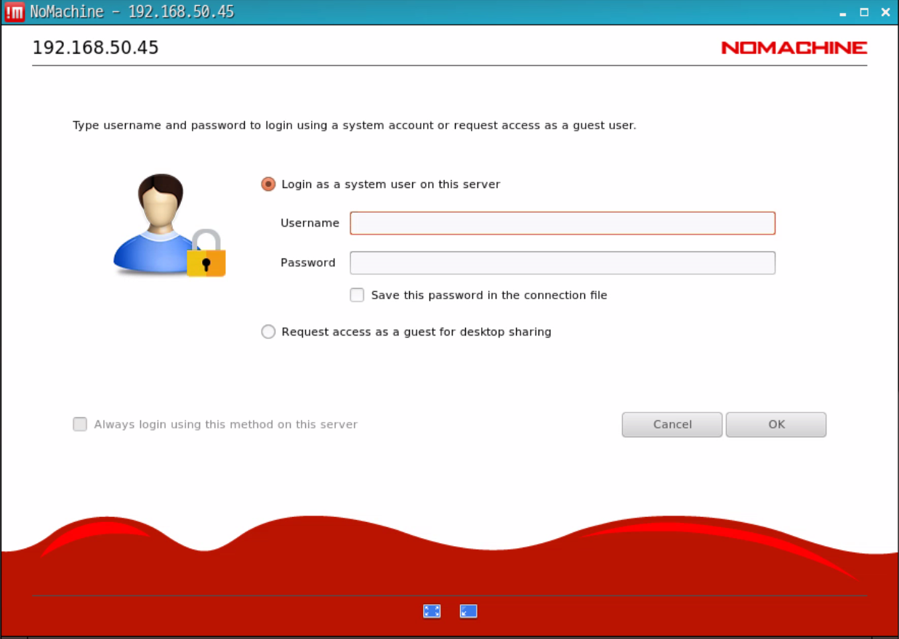
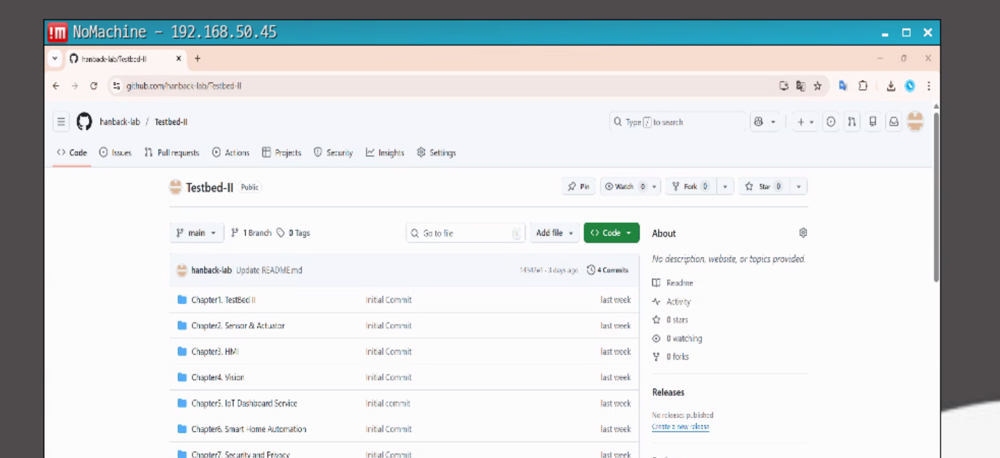

# Remote Session

AIoT Testbed II의 EdgeAI에서 사용자의 PC 화면을 표시하여 화면 공유 및 원격 제어를 실시할 수 있습니다. 본 챕터는 Windows 11 PC를 기반으로 작성되었습니다.

모든 작업은 Testbed II에 부착된 공유기에 사용자 PC를 연결한 후 작업을 진행합니다.

## NoMachine 설치

다음 웹사이트에 접속하여 원격 세션 툴인 NoMachine을 설치합니다. 접속 후 'Download now' 버튼을 눌러 설치 파일을 다운로드 받습니다.

- https://www.nomachine.com/



다운로드 받은 설치 파일을 실행하여 NoMachine을 설치합니다.

## 사용자 PC IP 확인

`Win + x`를 눌러 표시되는 작업 표시줄 메뉴에서 '터미널' 을 실행합니다. 


<br><br>

그 후, 표시되는 터미널 창에서 `ipconfig` 명령어를 입력하여 사용자 IP를 확인합니다. 출력 내용 중 Wi-Fi 항목에 기재된 Ipv4 주소를 확인합니다.  


<br><br>

## SSH 접속

터미널 창에서 아래와 같이 명령어를 입력합니다. 접속하는 계정 정보는 아래와 같습니다.

- ID : soda
- PW : soda

```sh
ssh soda@192.168.50.2
```



## 명령어 실행

접속된 SSH 터미널에서 아래 명령어를 실행합니다. 입력하는 `<IP>` 는 위 과정에서 파악한 접속하려는 사용자 PC의 IP를 기재합니다. 

```sh
remote_display <IP>
```


<br><br>

명령어를 입력할 시 EdgeAI의 디스플레이에서 원격 접속 프로그램이 자동으로 실행되며, 사용자 계정 정보를 입력하는 화면이 출력됩니다. 'Username' 에선 사용자 PC의 계정 이름을, 'Password' 에서는 계정 비밀번호를 입력합니다.


<br><br>

아래는 접속 성공 후 공유되고 있는 화면입니다.

